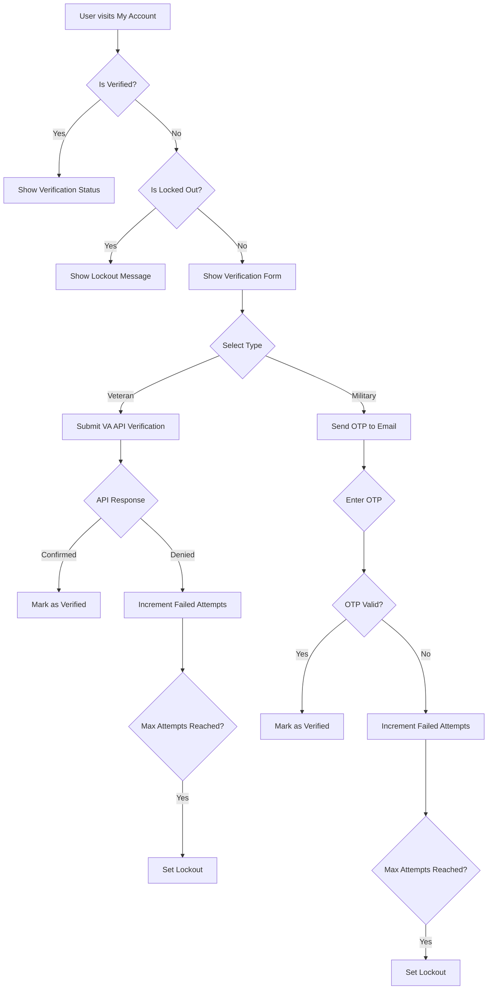

# Military Discounts Plugin Architecture Analysis

## Overview

The Military Discounts plugin is a WooCommerce extension that verifies current US military and veterans status and automatically issues coupons. It supports two primary verification methods:

1. **VA API**: Uses the VA Veteran Confirmation API to verify veteran status
2. **Military OTP**: Uses one-time passcode verification via .mil email addresses

## Plugin Structure

### Core Files

- **Main Plugin File** ([`military-discounts.php`](../military-discounts.php))
  - Plugin initialization
  - Autoloader for classes
  - Activation/deactivation hooks
  - Default settings configuration

- **Loader Class** ([`includes/class-md-loader.php`](../includes/class-md-loader.php))
  - Central orchestrator for initializing all plugin components
  - Manages dependencies between core classes
  - Handles admin, public, and email component initialization

## Verification Methods

### 1. VA API Verification ([`includes/class-md-va-api.php`](../includes/class-md-va-api.php))

#### Flow:
1. User submits personal information (name, birthdate, address, etc.)
2. Plugin sends request to VA API
3. API returns verification status (confirmed or not confirmed)
4. If confirmed, user is marked as verified veteran
5. If denied, failed attempt is tracked

#### Key Features:
- Sandbox mode for testing
- Rate limiting and retry logic
- Error handling and logging
- Lockout mechanism for failed attempts

### 2. Military OTP Verification ([`includes/class-md-military-otp.php`](../includes/class-md-military-otp.php))

#### Flow:
1. User enters military email address (.mil domain)
2. Plugin validates email against whitelist/blacklist
3. OTP is generated and sent to email
4. User enters OTP for verification
5. If valid, user is marked as verified military

#### Key Features:
- Email pattern validation
- Name matching (optional, configurable)
- OTP expiry (15 minutes by default)
- Cooldown period between OTP requests

## Settings System

### Security Settings ([`admin/class-md-settings.php`](../admin/class-md-settings.php))

Current security settings include:
- **Enable Lockout Feature**: Global toggle for lockout mechanism
- **Max Failed Veteran Attempts**: Default 5 attempts
- **Veteran Lockout Duration**: Default 60 minutes
- **Max Failed Military Attempts**: Default 5 attempts  
- **Military Lockout Duration**: Default 60 minutes
- **Lockout Notification Email**: Send email when user is locked out

### Settings Storage:
All settings are stored in WordPress options table with these keys:
- `md_settings_general` - General plugin settings
- `md_settings_va_api` - VA API configuration
- `md_settings_military_otp` - Military OTP configuration
- `md_settings_queue` - Queue management settings
- `md_settings_logs` - Log retention settings
- `md_settings_security` - Security/lockout settings

## User Management

### Verification Status Storage ([`includes/md-functions.php`](../includes/md-functions.php))

User verification status is stored as user meta fields:

1. **Veteran Status**:
   - `is_verified_veteran`: boolean (1 for verified)
   - `_md_veteran_verified_at`: timestamp of verification

2. **Military Status**:
   - `is_verified_military`: boolean (1 for verified)  
   - `_md_military_verified_at`: timestamp of verification

3. **Failed Attempts Tracking**:
   - `_md_failed_veteran_attempts`: count of failed veteran attempts
   - `_md_last_veteran_attempt_at`: timestamp of last failed attempt
   - `_md_failed_military_attempts`: count of failed military attempts
   - `_md_last_military_attempt_at`: timestamp of last failed attempt

4. **Lockout Status**:
   - `_md_veteran_lockout_until`: timestamp when veteran lockout ends
   - `_md_military_lockout_until`: timestamp when military lockout ends

## Queue Management

### Pending Verification Queue ([`includes/class-md-queue.php`](../includes/class-md-queue.php))

- Used for handling API failures or temporary errors
- Queue items are encrypted and stored as user meta (`_md_pending_verification`)
- Global index of pending users stored in `md_pending_verification_index` option
- Retry logic with configurable interval and max retries

## Public-Facing Verification

### My Account Integration ([`public/class-md-my-account.php`](../public/class-md-my-account.php))

- Adds "Military Discounts" endpoint to WooCommerce My Account section
- Step-by-step verification process
- Displays verification status
- Shows pending verifications
- Displays failed attempts count
- Shows lockout messages

### AJAX Endpoints ([`public/class-md-ajax.php`](../public/class-md-ajax.php))

1. `md_get_form_fields`: Get verification form fields based on type
2. `md_submit_veteran_verification`: Submit veteran verification
3. `md_send_military_otp`: Send military email OTP
4. `md_verify_military_otp`: Verify military OTP
5. `md_check_billing_name`: Check if user has billing name set
6. `md_validate_military_email`: Validate military email format
7. `md_check_email_name_match`: Check if email matches user's name

## Logging System

### VA API Logger ([`includes/class-md-logger.php`](../includes/class-md-logger.php))

- Logs all VA API requests and responses
- Redacts PII fields (birthDate, ssn, streetAddress)
- Logs stored in `md_va_api_logs` option
- Log retention period configurable (default 30 days)
- Max 500 logs stored (older logs are discarded)

## Current Lockout Implementation

### Security Functions ([`includes/md-functions.php`](../includes/md-functions.php))

Key functions:
- `md_get_security_settings()`: Get security configuration
- `md_get_failed_attempts()`: Get count of failed attempts
- `md_increment_failed_attempts()`: Increment failed attempts counter
- `md_reset_failed_attempts()`: Reset failed attempts and lockout
- `md_is_locked_out()`: Check if user is currently locked out
- `md_get_lockout_remaining()`: Get remaining lockout time in minutes
- `md_set_lockout()`: Set lockout for a user

### Lockout Trigger Points:

1. **VA API Verification**:
   - Lockout check before API call
   - Failed attempts incremented for permanent denials
   - Lockout triggered when max attempts reached

2. **OTP Verification**:
   - Lockout check before OTP validation
   - Failed attempts incremented for invalid OTP
   - Lockout triggered when max attempts reached

### UI Lockout Display:

- My Account page shows lockout message with remaining time
- AJAX responses return lockout status and message
- Lockout notifications can be sent via email

## Code Flow Analysis

### Verification Process Flow Chart

## Current Issues and Limitations

### 1. Incomplete Failed Attempts Tracking for VA API

- Currently only tracks failed attempts for permanent denials
- Does not track failed attempts for API errors or temporary failures

### 2. No Lockout Notification Email

- The `send_lockout_notification` setting exists but no implementation
- No email is actually sent when user is locked out

### 3. No Failed Attempts Display on Frontend

- Failed attempts count is retrieved but not clearly displayed
- Users don't see how many attempts they've used

### 4. Inconsistent Error Handling

- Some errors increment failed attempts, others don't
- API errors are queued for retry without incrementing attempts

## Recommendations for Maximum Failed Attempts Feature

### 1. Complete Failed Attempts Tracking

- Track all verification attempts (successful, failed, errored)
- Increment failed attempts for all unsuccessful verifications

### 2. Implement Lockout Notifications

- Create email template for lockout notifications
- Send email when user is locked out

### 3. Enhanced Frontend UI

- Show failed attempts counter clearly
- Display progress towards lockout
- Add visual indicators for remaining attempts

### 4. Consistent Error Handling

- Standardize failed attempts tracking across all verification scenarios
- Handle edge cases (API timeouts, network errors) consistently

### 5. Admin Reporting

- Add failed attempts and lockouts to admin logs
- Provide insights into verification attempt patterns
- Allow admins to reset failed attempts for users

### 6. Configuration Options

- Allow configuring failed attempts threshold per verification method
- Allow configuring lockout duration per verification method
- Add option to disable lockout feature

## Database Schema

### User Meta Fields

| Meta Key | Type | Description |
|----------|------|-------------|
| `is_verified_veteran` | boolean | Veteran verification status |
| `_md_veteran_verified_at` | timestamp | Veteran verification time |
| `is_verified_military` | boolean | Military verification status |
| `_md_military_verified_at` | timestamp | Military verification time |
| `_md_failed_veteran_attempts` | integer | Failed veteran attempts count |
| `_md_last_veteran_attempt_at` | timestamp | Last veteran attempt time |
| `_md_failed_military_attempts` | integer | Failed military attempts count |
| `_md_last_military_attempt_at` | timestamp | Last military attempt time |
| `_md_veteran_lockout_until` | timestamp | Veteran lockout expiration |
| `_md_military_lockout_until` | timestamp | Military lockout expiration |
| `_md_pending_verification` | encrypted string | Pending verification data |

### Options Table

| Option Name | Type | Description |
|-------------|------|-------------|
| `md_settings_general` | array | General plugin settings |
| `md_settings_va_api` | array | VA API configuration |
| `md_settings_military_otp` | array | Military OTP configuration |
| `md_settings_queue` | array | Queue management settings |
| `md_settings_logs` | array | Log retention settings |
| `md_settings_security` | array | Security/lockout settings |
| `md_pending_verification_index` | array | Index of users with pending verifications |
| `md_va_api_logs` | array | VA API request/response logs |

This comprehensive analysis provides the foundation for implementing the maximum failed verification attempts feature. The current architecture already has a solid framework for tracking failed attempts and lockouts, but it needs to be completed and enhanced to provide a robust and user-friendly experience.
